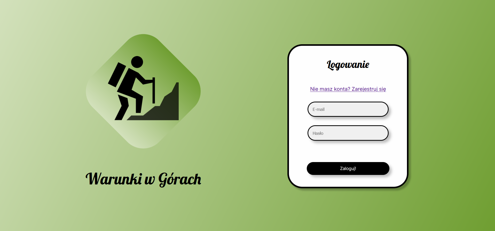
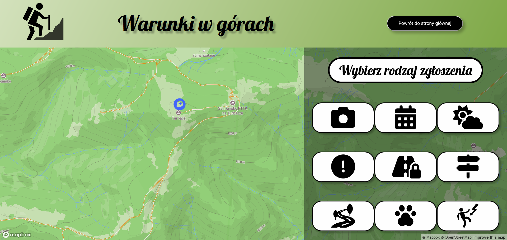

# WDPAI
## Web application - Warunki w Górach

Projekt szkoleniowy na zajęcia z przedmiotu "Wstęp od projektowania aplikacji internetowych". </br>
Training project for university course "Introduction to Web Application Design".

## Table of contents
* [General info](#general-info)
* [Technologies](#technologies)
* [Setup](#setup)
* [Views](#views)

## General info

A website application called "Warunki w Górach" was created especially for people who enjoy hiking. The software gives users a platform to exchange useful trail-related information, such as the state of the trails, the weather, and other crucial details. Hikers may easily and confidently keep informed and organize their treks with "Warunki w Górach."
The application offers users a special function that enables them to post advertising in order to find a hiking partner for their next hike in addition to trail information. Finding a reliable and compatible hiking companion is essential to ensuring a secure and enjoyable journey, regardless of whether you are an experienced hiker or a newbie. This process is made simple and convenient by this app, which connects users with people who share their enthusiasm for hiking.

## Technologies
Project is created with:
* Docker
* JavaScript
* CSS
* PHP ver. 7.1
* PostgreSQL

## Setup
To run this project, install Docker Desktop application, open main folder in terminal and execute:

```
docker-compose build
docker-compose run
```

The database.sql file contains an example database's contents.

## Views



